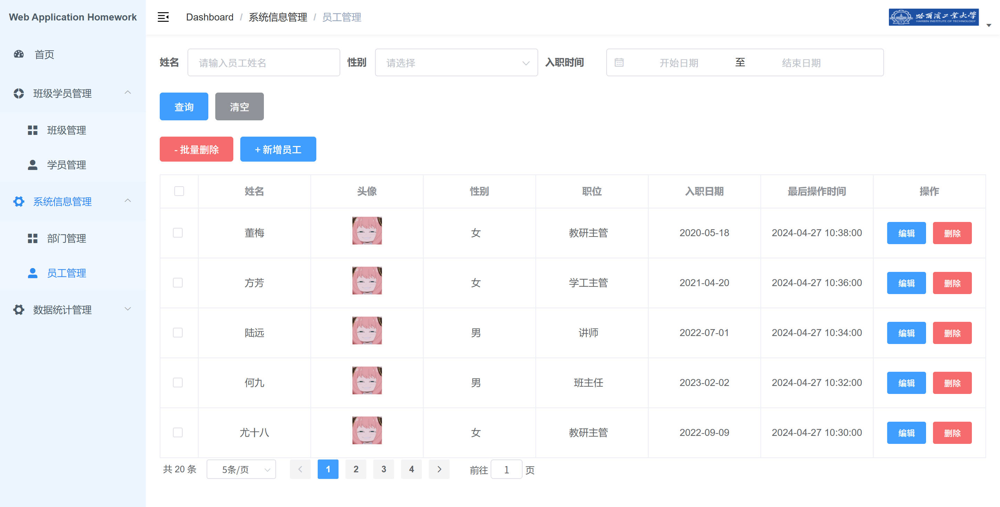

# 🚀 Campus Management System

Welcome! This is a full-stack campus management system designed to handle core functionalities for managing employees, departments, classes, and students.

The system is built with a decoupled front-end and back-end architecture. The front end manages user interaction and data display, while the back end provides RESTful APIs and handles business logic. User authentication is secured using JSON Web Tokens (JWT).

## ✨ Key Features

The system includes the following major modules:

* **🔑 Login & Registration**
    * **Employee Login**: Users can log in with a username and password to receive a JWT token from the server. 
    * **Employee Registration**: Allows new employees to register, after which they are redirected to the login page. 

* **🏢 Department Management**
    * View a list of all departments. 
    * Add, edit, and delete department information.

* **👥 Employee Management**
    * Search and filter the employee list by name, gender, and hire date, with pagination support.
    * Add, edit, and delete employee records (with support for bulk deletion). 

* **🏫 Class Management**
    * Search and filter the class list by name and date range, with pagination. 
    * Add, edit, and delete class records. 

* **🎓 Student Management**
    * Perform multi-criteria searches for students by name, student ID, education level, and class. 
    * Add, edit, and delete student records (with support for bulk deletion). 
    * Handle student disciplinary actions by adding demerit points and tracking infractions. 

## 📸 Screenshots

Here are some screenshots of the application in action.

**Login Page**


**Department Management**


**Employee Management**


## 📂 Project Structure

```bash
.
├── backend/         -- Backend Spring Boot Project
├── database/        -- Database SQL Files
├── frontend/        -- Frontend Vue Project
├── hook/            -- Project Images Files
└── README.md        -- Project README File
```

## ⚙️ Quick Start

### 1. 💾 Database Setup

1.  Make sure you have MySQL installed and running.
2.  Create a new database.
3.  Import the SQL file from the `database/` directory into your newly created database to initialize the tables and data.

### 2. 🖥️ Backend Startup

1.  Open the `backend/` directory in your preferred Java IDE (like IntelliJ IDEA).
2.  Navigate to `src/main/resources/application.yml` to configure the project:
    * **Database**: Update the `datasource` section with your MySQL connection details (URL, username, and password).
    * **Alibaba Cloud OSS**: This project uses Alibaba Cloud OSS for file storage. You need to register an account and replace the placeholder values under the `aliyun.oss` section with your own `endpoint`, `accessKeyId`, `accessKeySecret`, and `bucketName`.
3.  Run the Spring Boot application.

### 3. 🌐 Frontend Startup

1.  Open the `frontend/` directory in your code editor (like VS Code).
2.  Run `npm install` in the terminal to install all the necessary dependencies.
3.  Run `npm run serve` to start the frontend development server.
4.  Open your browser and navigate to `http://localhost:8080` (or the address shown in your terminal).
